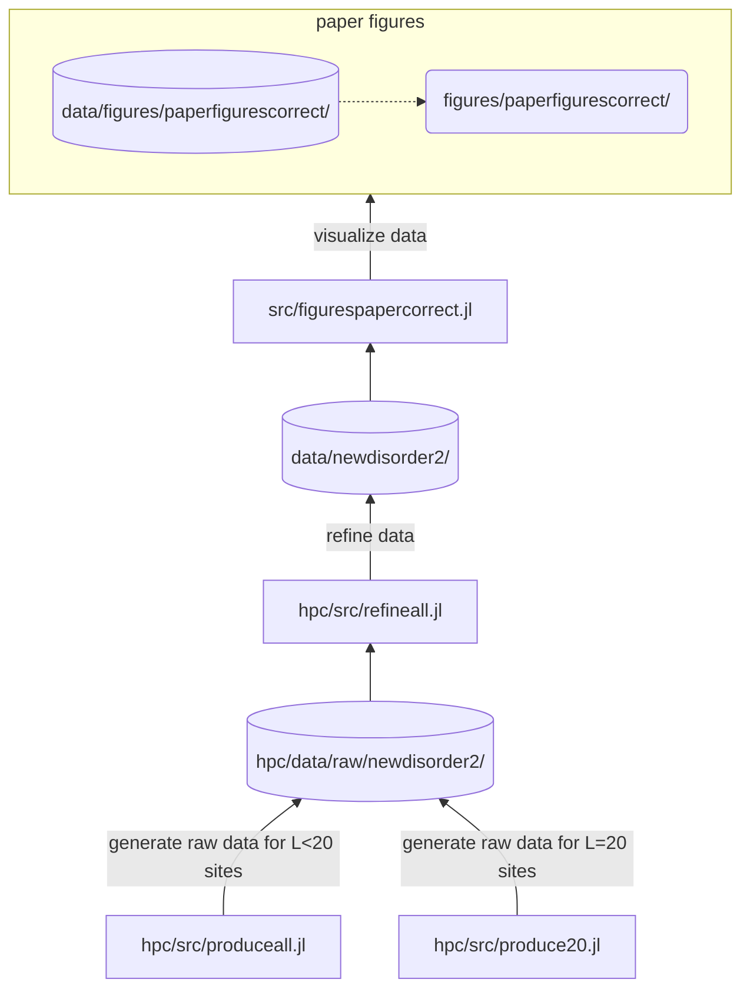

# Enhanced many-body localization in a kinetically constrained model

## Origin of data:


- figures are stored at [figures/paperfigurescorrect/](https://github.com/karlwessel/kcmpaper/blob/main/figures/paperfigurescorrect/)
- datapoints displayed in figures are stored at [data/figures/paperfigurescorrect/](https://github.com/karlwessel/kcmpaper/blob/main/data/figures/paperfigurescorrect)
- source code to generate figures is stored at [src/figurespapercorrect.jl](https://github.com/karlwessel/kcmpaper/blob/main/src/figurespapercorrect.jl)
- refined data used to generate figures from is stored at [data/newdisorder2/](https://github.com/karlwessel/kcmpaper/blob/main/data/newdisorder2)
- source code to generate refined data from raw data is stored at [hpc/src/refineall.jl](https://github.com/karlwessel/kcmpaper/blob/main/hpc/src/refineall.jl)
- raw data is not included in the repository
- source code to generate raw data is stored at [hpc/src/produceall.jl](https://github.com/karlwessel/kcmpaper/blob/main/hpc/src/produceall.jl) and [hpc/src/produce20.jl](https://github.com/karlwessel/kcmpaper/blob/main/hpc/src/produce20.jl)

## Reproduce results
When the repository was checked out the first time you need to instantiate the Julia-environments for the project:
1. Start the Julia REPL in the base directory of the repository:

     ```julia```
1. Switch julias build in pkg manager by pressing `]`
3. Activate the projects environment:
   
     ```activate .```
5. Instantiate the environment:
   
    ```instantiate```
   
   Julia will precompile all necessary libraries, this will take some time.
7. Activate HPC sub-environment:
   
   ```activate hpc```
9. Instantiate the HPC environment:
    
   ```instantiate```
   
   This will take some time.

If everything is done you can exit Julias REPL by pressing `CTRL+D`. You wont need to do the above steps again.

### Create paper figures from refined data
The refined data is included in the repository under `data/newdisorder2`. From these you can create the figures of the paper by executing the script under `src/figurespapercorrect.jl`:

```julia --project src/figurespapercorrect.jl```

### Create raw data and refine it
To recreate the refined data you first need to create the raw data and then refine it.

1. Switch to the `hpc` directory of the repository:

   `cd hpc`
2. Create raw data for configurations with up to 16 sites:

   `julia --project src/produceall.jl`

   This may take some time and is better done on some HPC. You can take a look at the according scripts under `hpc/scripts`.
3. Create raw data for configurations with 20 sites:

   `julia --project src/produce20.jl`

   This will take really long (weeks on a single core) and needs a lot of memory. You may run it locally, but running it on a HPC is highly recommended.
4. Refine raw:
   
   `julia --project src/refineall.jl`

   This may take about an hour.
5. You can find the refined results under:

   `hpc/data/newdisorder/`

